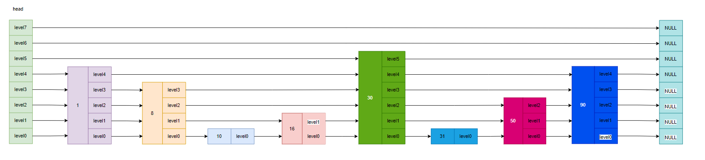
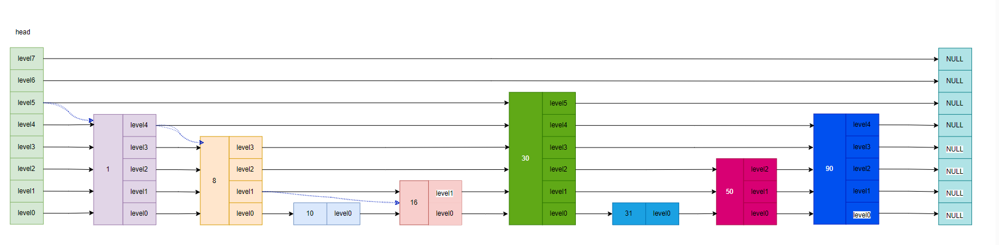
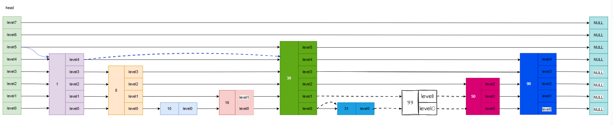
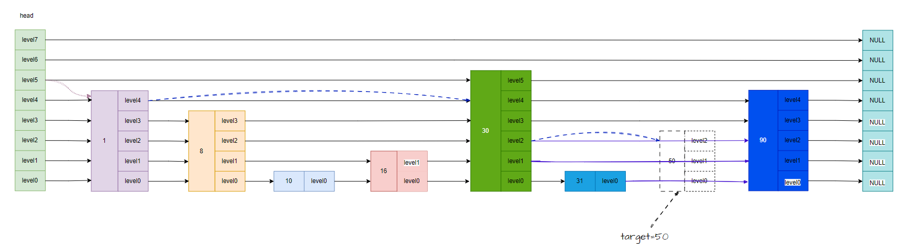
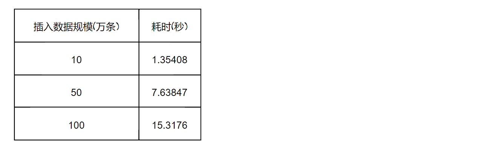

## KV存储引擎

111

本项目基于跳表实现的轻量级键值型存储引擎，使用C++实现。插入数据、删除数据、更改数据、查询数据、数据展示、数据落盘、文件加载数据，以及数据库大小显示。
- insert_element（插入数据）
- delete_element（删除数据）
- update_element（更新数据）
- search_element（查询数据）
- display_list（数据展示，包含每一层的数据）
- dump_file（数据落盘）
- load_file（加载数据）
- size（查询跳表大小）
## 项目中文件说明

- bin文件中包含可执行文件的目录
- Skiplist文件包含头文件skiplist,跳表的核心实现
- File文件，数据落盘存放的目录
- stressTest文件存放压力测试的源文件stress_test.cpp
- main.cpp包含skiplist.h使用跳表实现数据操作
- makefile编译脚本
- stress_test_start.sh 压力测试脚本
- README.md项目说明

## 跳表实现

level 数组中的每一个元素代表跳表的一层，也就是由 zskiplistLevel 结构体表示，比如 leve[0] 就表示第一层，leve[1] 就表示第二层。zskiplistLevel 结构体里定义了「指向下一个跳表节点的指针」和「跨度」，跨度时用来记录两个节点之间的距离。

查找一个跳表节点的过程时，跳表会从头节点的最高层开始，逐一遍历每一层。在遍历某一层的跳表节点时，会用跳表节点中的 SDS 类型的元素和元素的权重来进行判断，共有两个判断条件：

- 如果当前节点的权重「小于」要查找的权重时，跳表就会访问该层上的下一个节点。
- 如果当前节点的权重「等于」要查找的权重时，并且当前节点的 SDS 类型数据「小于」要查找的数据时，跳表就会访问该层上的下一个节点。

如果上面两个条件都不满足，或者下一个节点为空时，跳表就会使用目前遍历到的节点的 level 数组里的下一层指针，然后沿着下一层指针继续查找，这就相当于跳到了下一层接着查找。



#### 查找元素



#### 插入元素



跳表的相邻两层的节点数量的比例会影响跳表的查询性能。Redis 则采用一种巧妙的方法是，**跳表在创建节点的时候，随机生成每个节点的层数**，并没有严格维持相邻两层的节点数量比例为 2 : 1 的情况。

这里采用了下面的代码实现层数大小

概率算法：

- 每一层的节点，被提取到上一层的概率是1 / 2;
- 原始链表提取到一级索引的概率是1 / 2。
- 原始链表提取到二级索引的概率是1 / 4。
- 原始链表提取到三层索引的概率是1 / 8。

```c++
template <typename K, typename V>
int Skiplist<K,V>::get_random_level(){

    int k=1;
    while(rand()%2){
        k++;
    }
    k=(k<_max_level)?k:_max_level;
    return k;
}
```

插入实现

```c++
Node<K,V>*update[_max_level+1];//保存的是层符合条件的下一个节点，就是第一个不符合条件的节点
```

```c++
for (int i = 0; i <= random_level; i++) {
     inserted_node->forward[i] = update[i]->forward[i];
     update[i]->forward[i] = inserted_node;
}
```

#### 删除元素



```c++
Node<K, V> *update[_max_level+1];//update数组 用于保存 删除节点前面的节点 ，用于删除节点后的指向链接，步骤和插入节点类似
```

```c++
 for (int i = 0; i <= _skip_list_level; i++) {
     // 如果 update[i] 已经不指向 current 说明 i 的上层也不会指向 current
     // 也说明了被删除节点层高 i - 1。直接退出循环即可
     if (update[i]->forward[i] != current) 
         break;
     // 如果是要删除的节点 重新设置指针的指向，将其指向下一个节点的位置
     update[i]->forward[i] = current->forward[i];
 }
```

## KV存储引擎数据性能

测试环境：内存

#### 插入操作

跳表树高：32

采用随机插入数据测试：



每秒可处理写请求数（QPS）: 6.53w

#### 查询操作


每秒可处理写请求数（QPS）: 5.064w

## 项目运行

```shell
make
./bin/main
```

脚本测试KV存储引擎的性能

```shell
sh stress_test_start.sh
```

## 项目中遇到的小问题

```shell
Segmentation fault(段错误)
```

解决方法

为了在程序崩溃时产生coredump文件，要设置coredump大小

```shell
ulimit -a
core file size          (blocks, -c) 0
data seg size           (kbytes, -d) unlimited
scheduling priority             (-e) 0
file size               (blocks, -f) unlimited
pending signals                 (-i) 7450
max locked memory       (kbytes, -l) 65536
max memory size         (kbytes, -m) unlimited
open files                      (-n) 3000
pipe size            (512 bytes, -p) 8
POSIX message queues     (bytes, -q) 819200
real-time priority              (-r) 0
stack size              (kbytes, -s) 8192
cpu time               (seconds, -t) unlimited
max user processes              (-u) 7450
virtual memory          (kbytes, -v) unlimited
file locks                      (-x) unlimited
```

core file size 默认设置为0

```
ulimit -c unlimited  //设置core file size 无限制
```

为了保证coredump文件名称的唯一性，可以用下面命令设置：

```
echo 'core.%e.%s.%t' > /proc/sys/kernel/core_pattern  # 设置生成的coredump文件名称
```

gdb调试

```
gdb 【可执行文件】 【core文件】
```

使用bt命令查看函数调用的栈帧(用where命令也可以)：

```shell
(gdb) bt
#0  0x0000562edff1d2fc in Skiplist<int, std::__cxx11::basic_string<char, std::char_traits<char>, std::allocator<char> > >::insert_element (this=0x562edff201c0 <skiplist[abi:cxx11]>, key=304735, value="a")
    at stressTest/../Skiplist/skiplist.h:169
#1  0x0000562edff1c777 in insertElement (threadid=0x0) at stressTest/stress_test.cpp:20
#2  0x00007f690af01609 in start_thread (arg=<optimized out>) at pthread_create.c:477
#3  0x00007f690ae26133 in clone () at ../sysdeps/unix/sysv/linux/x86_64/clone.S:95
```

可以用frame NUM查看栈帧

```shell
(gdb) frame 0
#0  0x0000562edff1d2fc in Skiplist<int, std::__cxx11::basic_string<char, std::char_traits<char>, std::allocator<char> > >::insert_element (this=0x562edff201c0 <skiplist[abi:cxx11]>, key=304735, value="a")
    at stressTest/../Skiplist/skiplist.h:169
169	            inserted_node->forward[i]=update[i]->forward[i];
(gdb) frame 1
#1  0x0000562edff1c777 in insertElement (threadid=0x0) at stressTest/stress_test.cpp:20
20	        skiplist.insert_element(rand()%TEST_COUNT,"a");

```